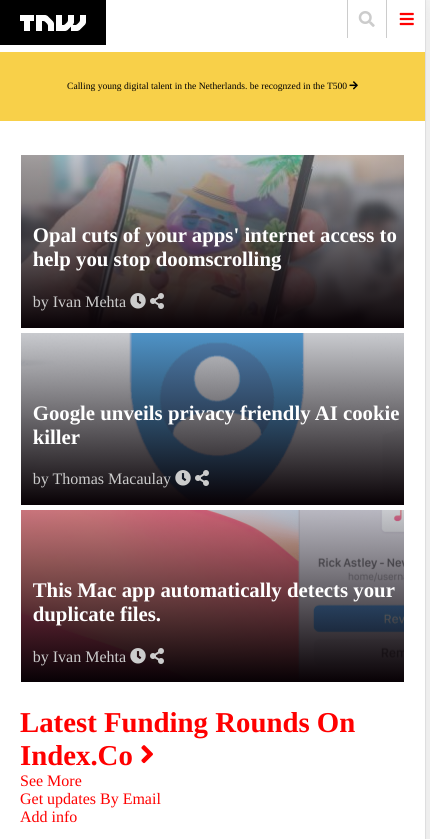
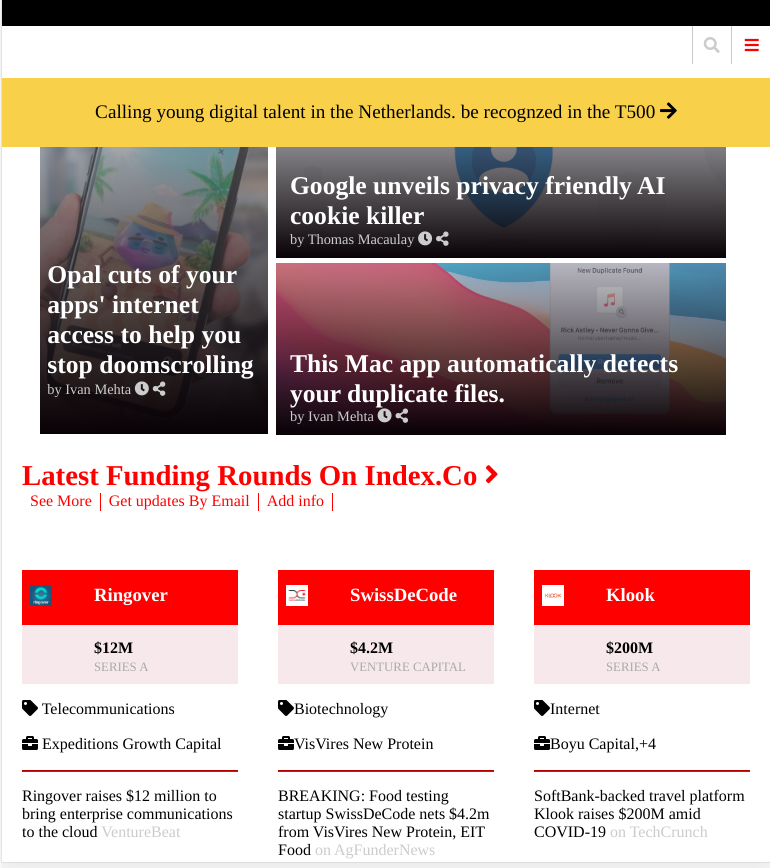
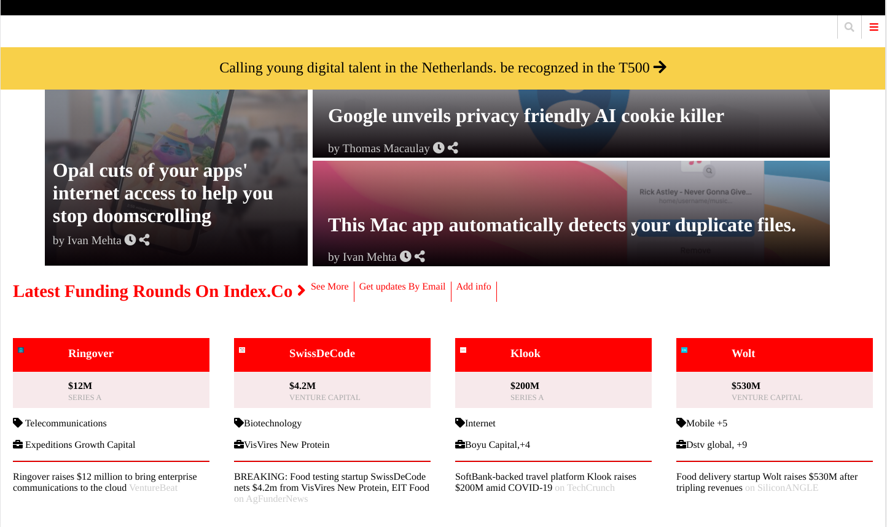

# TheNextWeb-clone

> A clone website of an archived article on The Next Web to practice Responsive Web Design

Mobile View

Tablet View

Desktop View

## Built With

- HTML5 & CSS3
- No frameworks

## Live Demo

[Live Demo Link](https://kjeanmark-thenextweb-clone.onrender.com)

## Getting Started

To get a local copy up and running follow these simple example steps.

### Setup
- Download this GitHub Repo and go the index.html file.

### Install
- Set up liveserver as an extension in your VS Code.

### Usage
- Right click and open the index.html in your browser to view.

## Authors

👤 **Kaboha Jean Mark**

- GitHub: [@KabohaJeanMark](https://github.com/KabohaJeanMark)
- Twitter: [@jean_quintus](https://twitter.com/jean_quintus)
- LinkedIn: [Jean Mark Kaboha](https://www.linkedin.com/in/jean-mark-kaboha-software-engineer/)

👤 **Tanzila Abedin**

- GitHub: [@tanzila-abedin](https://github.com/tanzila-abedin)
- Instagram: [@tanzi_abedin](https://www.instagram.com/tanzie_abedin/?hl=en)
- LinkedIn: [Tanzila Abedin](https://www.linkedin.com/in/tanzila-abedin-331440b2/?originalSubdomain=za)

## 🤝 Contributing

Contributions, issues, and feature requests are welcome!

Feel free to check the [issues page](issues/).

## Show your support

Give a ⭐️ if you like this project!

## Acknowledgments

- Hat tip to Microverse for the README template, instructions and tutoring.

## Inspirations
- 

## 📝 License

This project is [MIT](./LICENSE) licensed.
